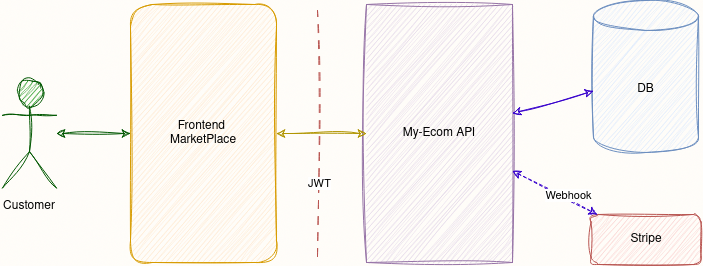

# My-Ecom API 🛒
Cloud native RESTful API for an e-commerce platform supporting products, carts, orders, Stripe payments, and user auth.

## Quick Start ⚡️
- ```git clone ```
- ```cd ecommerce-api```
- ```cp .env.example .env``` (edit values)
- ```docker build -t myecom .```
- ```docker run -p 8000:8000 --name MyEcom-API myecom```
## Features ⚙️
- Horizontal scalability
- Product CRUD with categories and tags
- Inventory management from the admin page
- Cart, checkout, order lifecycle
- Stripe payments and webhooks (test mode supported)
- JWT authentication (access + refresh tokens)
- Pagination, filtering, search, rate limiting
## Requirements 🔗
- Python >=3.10
- PostgreSQL >=12
- Stripe test account (for webhook secret and API keys)
## Running (local) 🔌
- Dev server:
  - ```python manage.py runserver 0.0.0.0:8000```
- Production (example using gunicorn):
  - ```pip install gunicorn```
  - ```gunicorn project.wsgi:application --bind 0.0.0.0:8000```
## API Documentation 🔖
- Schema at:
  - ```/api/schmea/```
- Swagger / Redoc available at:
  - ```/api/docs/swagger-ui/```
  - ```/api/docs/redoc/```
- OpenAPI version: v3
## Testing 🧪
- Run tests: ```python manage.py test```
## Deployment notes 🗒
- Set environment variables in production (SECRET_KEY, DATABASE_URL, STRIPE keys).
- Check deploy readiness:
  - ```python manage.py check --deploy```
- Run migrations and collectstatic:
  - ```python manage.py migrate```
  - ```python manage.py collectstatic --noinput```
- Configure HTTPS and publicly reachable Stripe webhook endpoint.
## License ⚖️
This project is distributed under [aGPLv3](./LICENSE) license.
